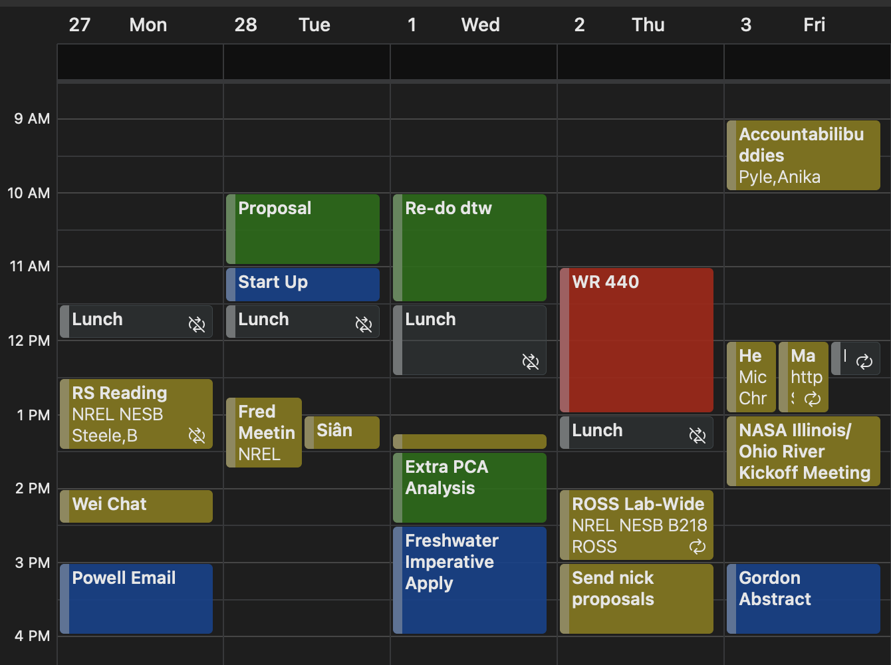

# Tips for Project and Time Management

Graduate studies is quite often a test of time management and you may find that what worked in your undergraduate degree does not work now (or it might!). Additionally, different people work differently and the working style may change over time. Below are some strategies that I've tried during my graduate studies - some were extremely helpful, some were less effective. I have found that what works best is whatever system that has the least cognitive load/effort so I can build a habit.

## Kanban Board/Checklist

The Kanban system is essentially a fancy checklist that helps you keep track of tasks, deadlines, and progress with a project.

\<picture\> <link> \<software\>

## Calendar Time Blocking

I actively use my calendar in conjunction with my checklist to make sure I have time in the week to accomplish the task. After mandatory events are filled out (meetings, class, other appointments), I try to block out time periods for specific tasks based on the Kanban board. If tasks are taking more/less time than expected, I can edit the events in my calendar, while seeing if I need to shift other tasks because of it.

{width="551"}

It's also helpful to know when you work best for different tasks (deep work vs reading vs coding vs mindless tasks). I encourage you to put in 'deep work' blocks in your calendar to protect time from meetings, other tasks. You should feel free to set your calendar to busy and slack/email notifications to Do Not Disturb.

## Research Notes

For the sake of reproducibility *and* your sanity, please keep good notes on your research. You should explore what methods work best for you! While not perfect, I have found that using OneNote has to most versatility and utility for the type of work we do. What I like about OneNote is that it's 1) easy to jot down notes, 2) copy in figures, code, screenshots, insert pictures of handwritten notes, etc. 3) organize thoughts on project, daily/weekly progress, etc.

In our work, it is extremely beneficial to keep note of:

-   sources for data, values for constants

-   assumptions for models

-   procedures/workflows, etc.

After publishing a paper, and when you graduate, I expect a copy of your research notes to be stored in the lab. It is of course easier to do if it's digital, but we can discuss what we can do if you have used a physical notebook.

## Footnotes

Footnotes are put inside the square brackets after a caret `^[]`. Like this one [^05-project-time-management-tips-1].

[^05-project-time-management-tips-1]: This is a footnote.

## Citations

Reference items in your bibliography file(s) using `@key`.

For example, we are using the **bookdown** package [@R-bookdown] (check out the last code chunk in index.Rmd to see how this citation key was added) in this sample book, which was built on top of R Markdown and **knitr** [@xie2015] (this citation was added manually in an external file book.bib). Note that the `.bib` files need to be listed in the index.Rmd with the YAML `bibliography` key.

The RStudio Visual Markdown Editor can also make it easier to insert citations: <https://rstudio.github.io/visual-markdown-editing/#/citations>
